# Wi-Fi Deauth Detection (Blue Team) 🔵📡


This repository documents my **defensive detection workflow** for Wi-Fi deauthentication (deauth) attacks using **Splunk Enterprise**.  
It is the **companion project** to my Red Team lab: **[wifi-deauth-attack-red](https://github.com/SecuredByKC/wifi-deauth-attack-red)**.

The exercise highlights how defenders can ingest packet captures, query for 802.11 deauth frames, visualize spikes in Splunk, and create alerts to detect abnormal management traffic.

**The objective:** detect the presence of a deauthentication attack (subtype `0x000c`) in captured Wi-Fi traffic, visualize abnormal activity, and summarize which APs and clients were affected.

> ⚠️ **Ethical Notice:** Performed only on a lab network I own, strictly for education and portfolio purposes. Do **not** capture/monitor networks without explicit authorization.

---

## ⚙️ Lab Environment

- **Platform:** VMware Workstation Pro  
- **Guest OS:** Two simultaneous Kali Linux VMs  
  - 🟥 **Red Team VM** → ran the deauth attack (documented in the [wifi-deauth-attack-red](https://github.com/SecuredByKC/wifi-deauth-attack-red) repo)  
  - 🟦 **Blue Team VM** → defensive monitoring with Splunk  
- **VM Resources (each):** 8 GB RAM • 4 vCPUs • 80 GB storage  
- **Wi-Fi Adapter:** ALFA AWUS036ACM (monitor mode capable, USB passthrough)  
- **Tools (Blue VM):** `airodump-ng`, `tshark`, `Splunk Enterprise 10`
- **Tools (Red Team):** `airmon-ng`, `airodump-ng`, `aireplay-ng`, `aircrack-ng`
- **Dataset:** CAP capture converted to CSV for Splunk ingestion  

---

## 📸 Step-By-Step Process (Commands + Evidence)

### 1) Capture Wi-Fi Traffic (Blue VM)
The Blue Team VM ran **airodump-ng** in passive mode to collect Wi-Fi management frames, focusing on the AP/channel targeted by the Red Team.

```bash
sudo airodump-ng -c 6 --bssid <TARGET_BSSID> -w blueteam_capture wlan0mon
```

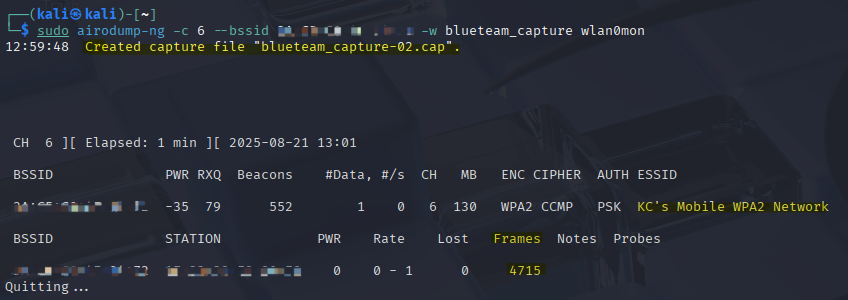

---

### 2) Convert CAP → CSV (for Splunk)
Convert the `.cap` into a compact CSV using 'tshark' with relevant 802.11 fields so Splunk can ingest and search quickly.

```bash
tshark -r blueteam_capture-02.cap   -T fields   -e frame.time_epoch   -e wlan.fc.type   -e wlan.fc.type_subtype   -e wlan.sa   -e wlan.da   -e wlan.bssid   -E header=y -E separator=,   > blueteam_capture.csv
```

- `frame.time_epoch` → becomes `_time` in Splunk (epoch seconds)  
- `wlan.fc.type_subtype` → **`0x000c` = deauth**

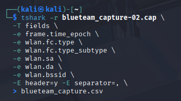

---

### 3) Upload CSV into Splunk
- **Add Data → Upload** → select `blueteam_capture.csv`  
- Ensure time is parsed from `frame.time_epoch`  
- Save sourcetype as **`wifi_csv`**

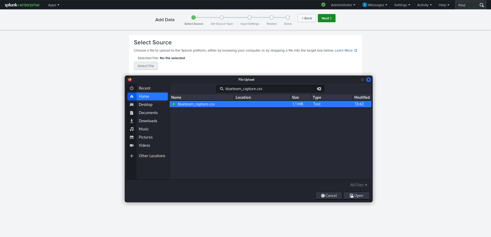  
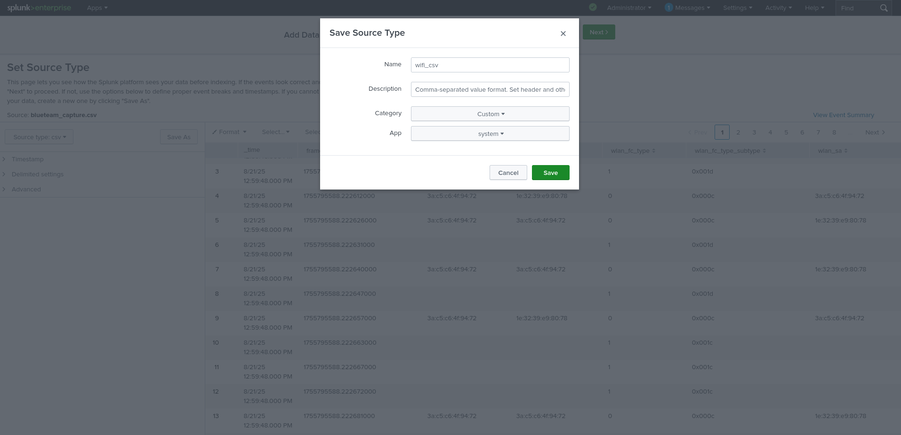  
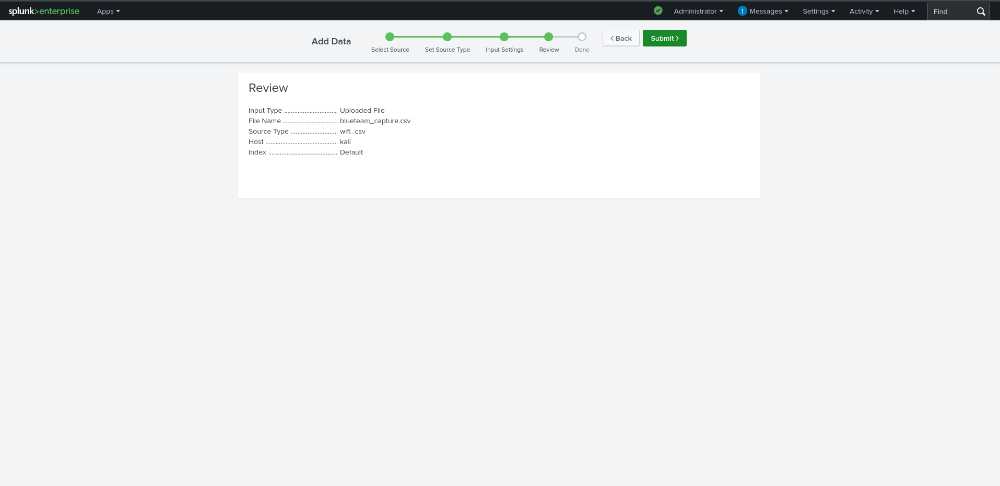  
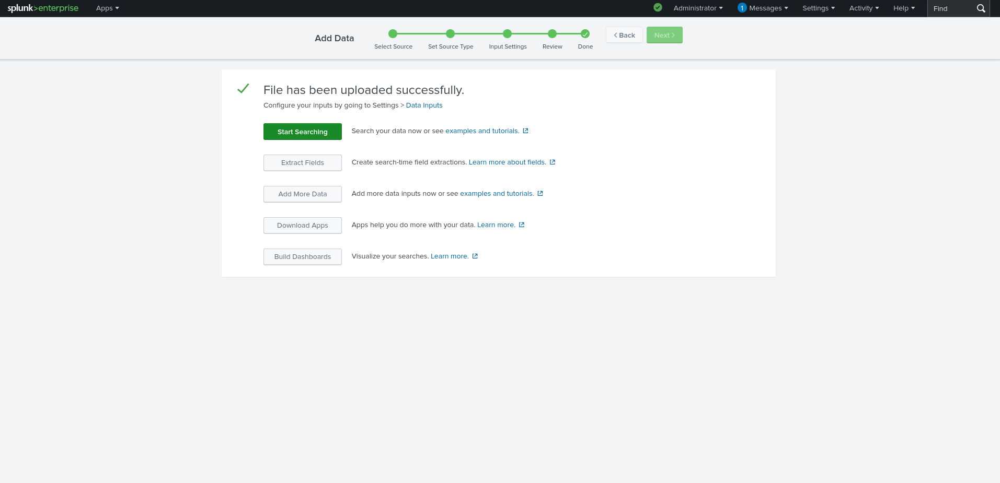

> **Note:** At search time, Splunk exposes dotted headers with underscores, so search on `wlan_fc_type_subtype` (underscores).

---

### 4) Searching the Data

**All events**
```spl
sourcetype="wifi_csv"
```
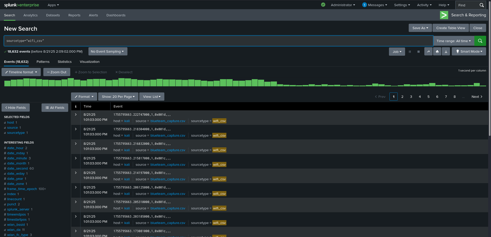

**Only deauth events**
```spl
sourcetype="wifi_csv" wlan_fc_type_subtype="0x000c"
```
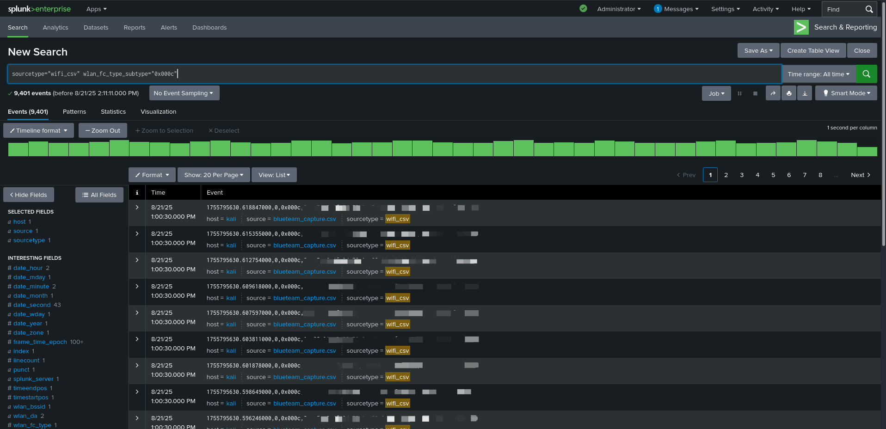

---

### 5) Visualization in Splunk

**Deauth spikes per second (line chart)**  
This search isolates only deauthentication frames (`0x000c`) and charts them per second.  

```spl
sourcetype="wifi_csv" wlan_fc_type_subtype="0x000c"
| timechart span=1s count AS 0x000c
```

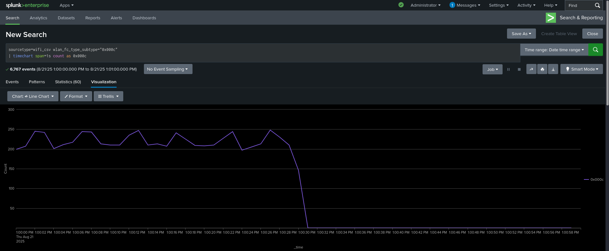 

**All management subtypes over time (line chart comparison)**  
This search charts all 802.11 management frame subtypes per second, allowing deauths (`0x000c`), represented by the pink line, to be compared against beacon, authentication, association, etc.  

```spl
sourcetype="wifi_csv"
| eval epoch = coalesce(frame_time_epoch, 'frame.time_epoch')
| eval _time = tonumber(epoch)
| timechart span=1s count BY wlan_fc_type_subtype
```

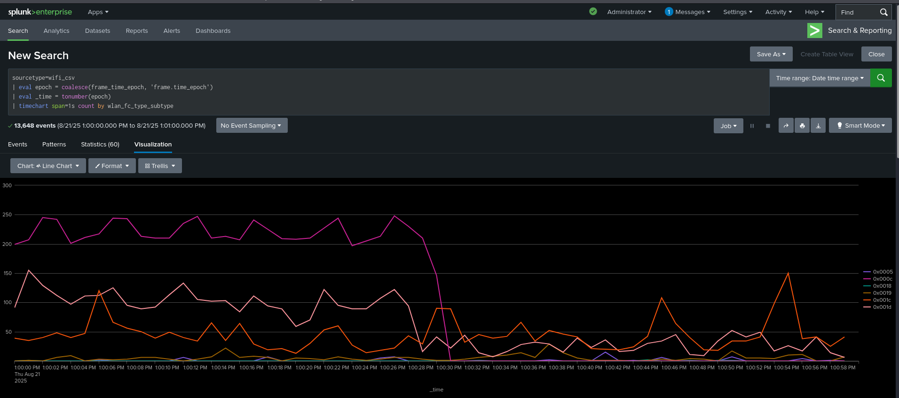  

**All management subtypes over time (stacked column chart)**  
Switching the visualization to *Column → Stacked* makes it easier to see relative volumes. Here, the sharp spike in deauth frames (pink) at the beginning is clearly distinguished from the baseline of beacons and other management traffic.  

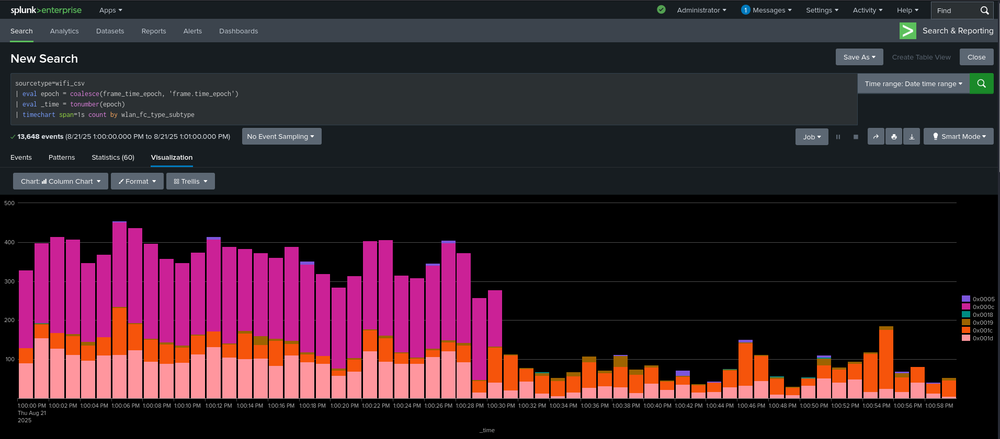

---

> 📝 **Note:** While Wireshark could have been used to easily detect deauthentication frames (via filters like `wlan.fc.type_subtype == 0x0c`), the purpose of this Blue Team lab was different.  
>  
> The goal was to capture wireless management traffic with `airodump-ng`, convert it into structured data, and ingest it into **Splunk**. This approach allowed for time-based visualizations, baselining, and repeatable queries — making it more representative of a real defensive monitoring workflow rather than a one-off packet analysis.

---

## ✅ Key Takeaways

- Built a **defensive workflow** to detect abnormal 802.11 deauth traffic in Splunk.  
- Verified deauth with `wlan_fc_type_subtype="0x000c"` and visualized **per-second spikes**.  
- Summarized **attack windows**  
- Complements the offensive lab in **[wifi-deauth-attack-red](https://github.com/SecuredByKC/wifi-deauth-attack-red)**.

---

## 📂 Repo Contents

- Evidence screenshots  
- This `README.md` documenting the setup, SPL, and results  

---

## 🔮 Future Work  

Next, I plan to expand this lab into a simple **incident documentation exercise**.  
The goal will be to create a structured incident record of the Wi-Fi deauthentication attack and resolution, modeled after how a SOC analyst or incident handler might report an event.  

This will involve:  
- Documenting the event using the **5 W’s** (Who, What, When, Where, Why).  
- Adding supporting evidence like packet captures and Splunk charts.

The result will be a clear **Incident Summary** that describes the attack timeline, observed patterns (initial spike → return to baseline), and key defensive takeaways.

---

## ⚖️ Legal & Ethical Reminder

This project is for **educational purposes only**.  
All captures were performed on my own wifi network.  
Never monitor or analyze traffic without explicit permission.

---

## 👤 Author

**Karim Cherradi**  
GitHub: [@SecuredByKC](https://github.com/SecuredByKC)
